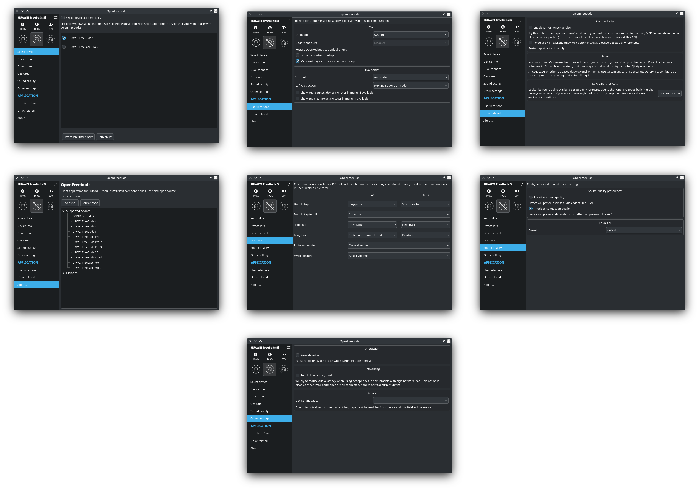

<div align="center">

<h1>OpenFreebuds</h1>
<p>Desktop application to manage wireless headphones from HUAWEI/Honor</p>
<p>


</p>
<p>
<a href="https://mmk.pw/en/openfreebuds"><b>💿 Download binaries</b></a> | <a href="https://crowdin.com/project/openfreebuds">🌍 Suggest translation</a>
</p>
</div>


Features
---------

- Dynamic system tray icon that shows current active noise cancellation mode and battery level;
- Tray menu with battery levels and active noise cancellation settings;
- Ability to change voice language for some models (4i, 5i);
- Device settings dialog, eg. change equalizer preset, gesture actions, etc;
- Built-in HTTP-server for remote control & scripting;
- Built-in global hotkeys support (for Windows and Xorg-Linux)


Device compatability
------------------------

Table bellow shows which devices and features currently are supported in OpenFreebuds.
If your device isn't listed here, you could try to use it with profile for other model.

Notes:
- HONOR Earbuds 2 Lite is same as HUAWEI FreeBuds 4i;
- HUAWEI FreeBuds Pro 2 currently is marked as alias for 5i, because I don't have any BT dumps from them.

Columns mean device model, rows mean feature name.

| **Feature name**                     | **SE** | **Lace Pro** | **4i** | **Pro** | **Pro 2** | **5i** | **Pro 3** |
|--------------------------------------|--------|--------------|--------|---------|-----------|--------|-----------|
| Fetch device info                    | 🟡     | 🟢           | 🟢     | 🟢      | 🟢        | 🟢     | 🟡        |
| Fetch battery level                  | 🟡     | 🟢           | 🟢     | 🟢      | 🟢        | 🟢     | 🟡        |
| Set double-tap action                | 🟡     | 🟢           | 🟢     |         | 🔴        | 🟢     | 🔴        |
| Control noise cancellation           |        | 🟢           | 🟢     | 🟢      | 🟢        | 🟢     | 🟡        |
| Set long-tap action                  |        | 🟢           | 🟢     | 🟢      | 🟢        | 🟢     | 🔴        |
| Set preferred ANC modes for gestures |        | 🟢           | 🟢     | 🟢      | 🟢        | 🟢     | 🔴        |
| Change voice language                |        | 🟢           | 🟢     | 🟢      | 🔴        | 🟢     | 🔴        |
| Fetch in-ear status                  |        |              | 🟢     | 🟢      | 🟢        | 🟢     | 🔴        |
| Pause when plug-off setup            |        |              | 🟢     | 🟢      | 🟢        | 🟢     | 🟡        |
| Toggle multi-device support          |        |              |        | 🟡      | 🟢        | 🟢     | 🟡        |
| List and switch between devices      |        |              |        | 🟡      | 🟢        | 🟢     | 🔴        |
| Set priority device                  |        |              |        | 🟡      | 🟢        | 🟢     | 🔴        |
| Swipe action setting                 |        |              |        |         | 🟢        | 🟢     | 🔴        |
| Sound quality preference             |        |              |        |         | 🟢        | 🟢     | 🟡        |
| Built-in equalizer presets           |        |              |        |         | 🟢        | 🟢     | 🟡        |
| Low-latency mode (Idk how it works)  |        |              |        |         |           | 🔴     | 🔴        |
| Custom equalizer presets             |        |              |        |         |           |        | 🔴        |

| Implementation level                               | Marker |
|----------------------------------------------------|--------|
| Fully implemented                                  | 🟢     |
| Partially implemented or not tested on real device | 🟡     |
| Not implemented, maybe not enough information      | 🔴     |
| Not supported by device                            |        |

If you want to get full support of your headphones, you can [create a Bluetooth-traffic](https://mmk.pw/en/posts/ofb-contribution/)
dump from Ai Life, which will contain all requests and responses that is used by official
app to manage your headset. Then send collected file to me, I'll analyze them and try to
implement their features in OpenFreebuds.

Download & install
-------------

### Microsoft Windows
_Requirements:_
- Windows 10/11;
- Bluetooth (4.2 or newer) adapter with Microsoft-compatible drivers;
- Administrator privileges

_Process:_ [Download installer](https://mmk.pw/en/openfreebuds), launch them and follow
on-screen instructions.

### Debian/Ubuntu and based- Linux distros
_Requirements_:
- Debian 12 or Ubuntu 22.04+, or any distro based on them
- Bluetooth (4.2 or newer) adapter

_Process:_ add repository and install package:

```shell
curl -Sl https://deb.mmk.pw/setup | sudo bash -
sudo apt install openfreebuds
```

Or grab deb-file from [here](https://deb.mmk.pw/pool/main/o/openfreebuds/).

### Arch linux / Manjaro
_Requirements_:
- Ability to install packages from [Arch User Repository](https://aur.archlinux.org/), `yay` is recommended;
- Bluetooth (4.2 or newer) adapter

_Process_: If you have `yay`, just install it from them:
```bash
yay -S openfreebuds
```

Otherwise, [download and build it manually](https://aur.archlinux.org/packages/openfreebuds).

Build from source code
---------

### Windows

_Requirements:_
- [Python 3.10-3.11](https://www.python.org/downloads/) (NOT from Microsoft Store, don't forgot to set 
  "Add to PATH" checkbox doing installation)
- [NSIS](https://nsis.sourceforge.io/Download) (optional, for installer)
- [UPX Packager](https://upx.github.io/) (optional)

Grab sources from here, if you don't. Open PowerShell or Windows 
Terminal in this directory. Create venv and install python packages:

```shell
python -m venv venv
.\venv\Scripts\activate
pip install -r requirements.txt
```

Now, run pyinstaller to build an executable:
```shell
pyinstaller .\openfreebuds.spec
```

Optional, make an installer package:
```shell
& 'C:\Program Files (x86)\NSIS\Bin\makensis.exe' .\openfreebuds.nsi
```

Result files will appear in `dist` directory.

### Linux

Install dependencies:
Python3, Pip3, Python3 GObject bindings (`gi`), Python3 Tkinter, Python3 DBus,
Python3 `psutil`, Python3 Pillow with ImageTk, Appindicator3 or AyatanaAppindicator3, 
Bluez sources (libbluetooth-dev), UPX (optional), Gtk3, Git, gcc, make

> For Debian/Ubuntu:
> ```bash
> sudo apt install make git gcc upx-ucl python3 python3-pip python3-wheel \
>   python3-gi python3-tk python3-dbus python3-pil python3-pil.imagetk \
>   gir1.2-appindicator3-0.1 | gir1.2-ayatanaappindicator3-0.1 \
>   libgtk-3-0 libbluetooth-dev
> ```

#### Run from source code
`python3-venv` and `build-essentials` are required, also as big part of libraries listed above.
```bash
python -m venv venv
source venv/bin/activate
pip install -r requirements.txt
python src/ofb_launcher.py
```

#### Install
Grab sources and run `make`:
```bash
git clone https://github.com/melianmiko/OpenFreebuds
cd OpenFreebuds
make
sudo make install # Install
```

#### Build debian package
```bash
dpkg-buildpackage -b # binary pkg
dpkg-buildpackage -S # source pkg
```


